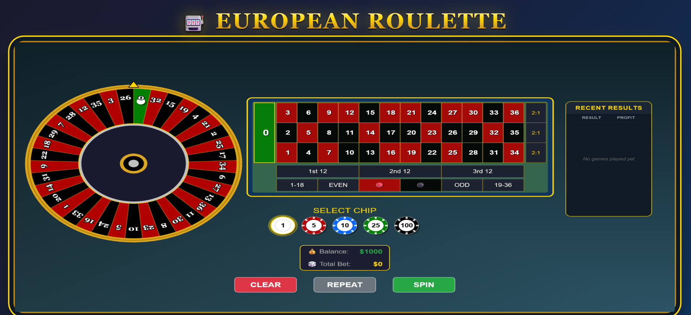
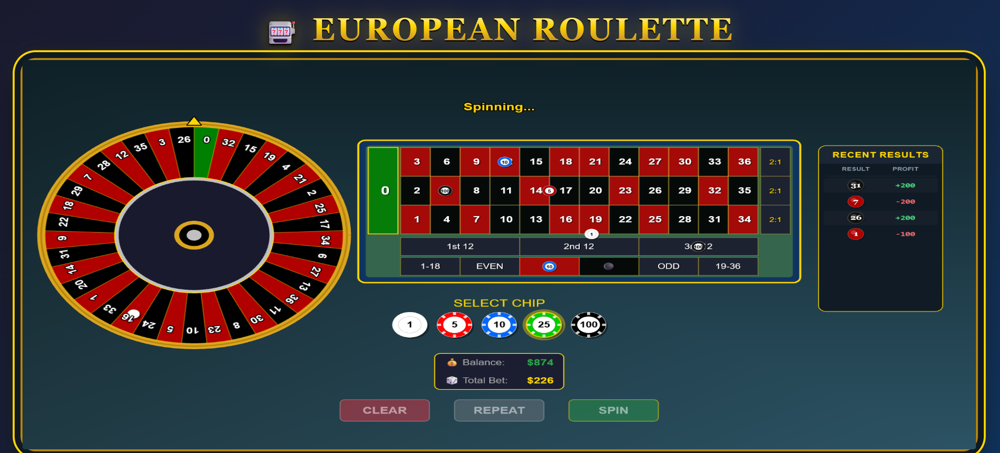
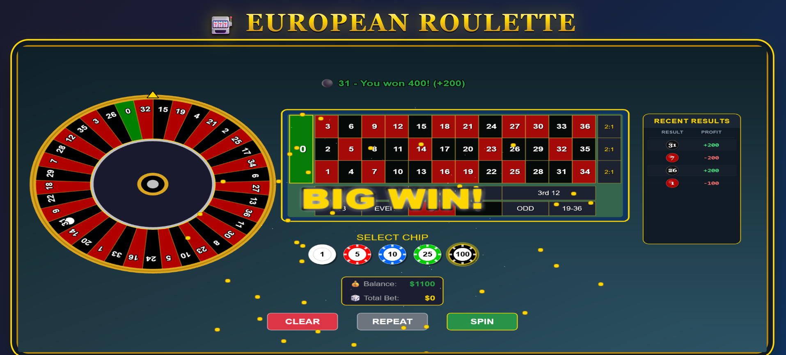

# 🎰 European Roulette Game

A full-stack European roulette game built with **TypeScript**, featuring a **Phaser 3** frontend and **Express** backend with **provably fair** random number generation.


## 🎯 Technical Showcase

This project serves as a comprehensive demonstration of **Full Stack Development** skills, focusing on:

- **Clean Architecture**: Strict separation of concerns between game logic (Backend) and presentation (Frontend).
- **Type Safety**: End-to-end TypeScript usage with shared type definitions and zero `any` types.
- **Testing Strategy**: High coverage (199+ tests) using Jest and Vitest for both unit and integration testing.
- **Algorithm Implementation**: Complex validation logic and Provably Fair RNG algorithms.
- **Modern Tooling**: Vite, Phaser 3, and Express in a monorepo-style structure.

## 📋 Table of Contents

- [Features](#-features)
- [Quick Start](#-quick-start)
- [Architecture](#-architecture)
- [API Documentation](#-api-documentation)
- [Game Rules](#-game-rules)
- [Design Decisions](#-design-decisions)
- [Project Structure](#-project-structure)
- [Testing](#-testing)
- [How to Play](#-how-to-play)

---

## ✨ Features

### Game Features

- ✅ **European Roulette** (Single zero: 0-36)
- ✅ **All 13 bet types** supported:
  - Inside bets: Straight Up, Split, Street, Corner, Line
  - Outside bets: Column, Dozen, Red/Black, Odd/Even, High/Low
- ✅ **Accurate payouts** (35:1 down to 1:1)
- ✅ **Animated wheel** with realistic spin
- ✅ **Interactive betting table** with chip placement
- ✅ **Game history** tracking
- ✅ **Balance management**

### Technical Features

- ✅ **Provably Fair RNG** using cryptographic HMAC-SHA256
- ✅ **Type-safe** - Full TypeScript across frontend and backend
- ✅ **RESTful API** following the specification
- ✅ **Zero dependencies** for game logic (Node.js crypto only)
- ✅ **Modular architecture** for maintainability

---

## Screenshots

<div align="center">
  
  <p><em>Clean and intuitive betting interface with European Roulette layout</em></p>
</div>

<br/>

<div align="center">
  
  <p><em>Smooth wheel animation and real-time game state updates</em></p>
</div>

<br/>

<div align="center">
  
  <p><em>Visual feedback and celebration effects for winning bets</em></p>
</div>

---

## 🚀 Quick Start

### Prerequisites

- Node.js 18+
- npm or yarn

### Installation

```bash
# Clone the repository
git clone https://github.com/NivBuskila/roulette.git
cd roulette

# Install backend dependencies
cd backend
npm install

# Install frontend dependencies
cd ../frontend
npm install
```

### Running the Application

**Terminal 1 - Start Backend:**

```bash
cd backend
npm run dev
# Server runs on http://localhost:3001 by default
```

**Terminal 2 - Start Frontend:**

```bash
cd frontend
npm run dev
# App runs on http://localhost:3000
```

**Open your browser at http://localhost:3000**

### Environment Variables

| Variable | Default | Description         |
| -------- | ------- | ------------------- |
| `PORT`   | `3001`  | Backend server port |

If port 3001 is in use, set a different port:

```bash
# Windows PowerShell
$env:PORT=3002; npm run dev

# Linux/Mac
PORT=3001 npm run dev
```

Remember to update `frontend/vite.config.ts` proxy target to match your backend port.

---

## 🏗️ Architecture

```
┌────────────────────────────────────────────────────────────┐
│                    FRONTEND (Phaser 3)                      │
│   ┌─────────────┐  ┌─────────────┐  ┌─────────────┐        │
│   │   Wheel     │  │   Betting   │  │   History   │        │
│   │  Component  │  │    Table    │  │   Display   │        │
│   └─────────────┘  └─────────────┘  └─────────────┘        │
│                           │                                 │
│                    API Service                              │
└───────────────────────────┼────────────────────────────────┘
                            │ HTTP/REST
┌───────────────────────────▼────────────────────────────────┐
│                    BACKEND (Express)                        │
│   ┌─────────────┐  ┌─────────────┐  ┌─────────────┐        │
│   │    Game     │  │   Payout    │  │     RNG     │        │
│   │   Service   │  │   Service   │  │   Service   │        │
│   └─────────────┘  └─────────────┘  └─────────────┘        │
│                           │                                 │
│               In-Memory State (Balance, History)           │
└────────────────────────────────────────────────────────────┘
```

### Key Principles

- **Server Authority**: All game logic runs on the backend - no client-side outcome calculation
- **Provably Fair**: Results can be mathematically verified
- **Type Safety**: Shared interfaces ensure frontend/backend consistency

---

## 📡 API Documentation

Base URL: `http://localhost:3001/api`

### Endpoints

#### GET /balance

Get current player balance.

**Response:**

```json
{
  "balance": 1000
}
```

#### POST /game/spin

Place bets and spin the wheel.

**Request:**

```json
{
  "bets": [
    {
      "type": "straight",
      "numbers": [17],
      "amount": 10
    },
    {
      "type": "red",
      "numbers": [
        1, 3, 5, 7, 9, 12, 14, 16, 18, 19, 21, 23, 25, 27, 30, 32, 34, 36
      ],
      "amount": 20
    }
  ]
}
```

**Response (Success):**

```json
{
  "success": true,
  "result": {
    "winningNumber": 17,
    "winningColor": "red",
    "totalBetAmount": 10,
    "totalWinAmount": 360,
    "netProfit": 350,
    "newBalance": 1350,
    "bets": [
      {
        "type": "straight",
        "numbers": [17],
        "amount": 10,
        "won": true,
        "payout": 360
      }
    ]
  }
}
```

#### GET /game/history

Get recent game history.

**Query Parameters:**

- `limit` (optional): Number of entries (default: 10)

**Response:**

```json
{
  "history": [
    {
      "timestamp": "2025-11-29T10:30:00Z",
      "winningNumber": 17,
      "winningColor": "red",
      "totalBetAmount": 10,
      "totalWinAmount": 360,
      "netProfit": 350
    }
  ]
}
```

#### POST /game/reset

Reset game state to initial values.

**Response:**

```json
{
  "success": true,
  "balance": 1000
}
```

---

## 🎲 Game Rules

### European Roulette

- 37 numbers: 0-36
- Single zero (green)
- House edge: 2.70%

### Bet Types & Payouts

| Bet Type    | Numbers Covered | Payout |
| ----------- | --------------- | ------ |
| Straight Up | 1               | 35:1   |
| Split       | 2               | 17:1   |
| Street      | 3               | 11:1   |
| Corner      | 4               | 8:1    |
| Line        | 6               | 5:1    |
| Column      | 12              | 2:1    |
| Dozen       | 12              | 2:1    |
| Red/Black   | 18              | 1:1    |
| Odd/Even    | 18              | 1:1    |
| High/Low    | 18              | 1:1    |

### Number Colors

- **Green**: 0
- **Red**: 1, 3, 5, 7, 9, 12, 14, 16, 18, 19, 21, 23, 25, 27, 30, 32, 34, 36
- **Black**: 2, 4, 6, 8, 10, 11, 13, 15, 17, 20, 22, 24, 26, 28, 29, 31, 33, 35

---

## 🔧 Design Decisions

### Standardization & Rule Compliance

To ensure a realistic and professional casino experience, the game logic strictly adheres to standard European Roulette rules, addressing common implementation pitfalls:

#### 1. Accurate Payout Calculation

Unlike simplified implementations that might only return the profit, this system correctly calculates the total return.

- **Formula**: `Total Return = (Bet Amount × Multiplier) + Bet Amount`
- **Example**: A winning 10 chip Straight Up bet (35:1) returns **360 chips** (350 profit + 10 original bet), matching real-world casino standards.

#### 2. Precise Game Logic

The system implements rigorous validation for game states:

- **Color Mapping**: Exact mapping of numbers to Red/Black according to the European wheel layout (e.g., 17 is Black).
- **Bet Resolution**: Complex bets are resolved atomically. For example, if 17 (Black) wins, a Red bet is correctly marked as lost, ensuring data integrity across all bet types.

---

### Architecture Choices

#### Why Express over NestJS?

- **Simplicity**: Lightweight architecture allowing for direct control over middleware and request flow.
- **Performance**: Minimal overhead for high-throughput game logic.
- **Flexibility**: Modular service design without the complexity of a full DI framework.

#### Why Phaser 3?

- **Industry Standard**: Powerful framework for 2D web games.
- **Rich features**: Built-in tweening, scene management, input handling.
- **WebGL acceleration**: Smooth 60fps animations.

#### Why In-Memory Storage?

- **Performance**: Ultra-low latency for real-time game state updates.
- **Simplicity**: Streamlined deployment without external database dependencies.
- **State Management**: Atomic state transitions for game rounds.

---

### Code Organization

#### Frontend: `managers/` vs `services/` Separation

The frontend has two distinct directories for different responsibilities:

| Directory   | Purpose           | Characteristics                                 |
| ----------- | ----------------- | ----------------------------------------------- |
| `services/` | API communication | Stateless, pure functions, no Phaser dependency |
| `managers/` | Game state & UI   | Stateful, Phaser-dependent, scene lifecycle     |

**Why not merge them?**

- `services/api.service.ts` can run anywhere (tests, CLI, etc.)
- `managers/` require `Phaser.Scene` - they ARE the game layer
- Follows Phaser community patterns (StateManager, InputManager, etc.)

#### Backend: Layered Service Architecture

```
Controller → Service → Validator
     ↓           ↓
  Routes    game.service.ts
              ↓    ↓    ↓
          payout  rng  validation
                         ↓
                   inside-bets.validator
                   outside-bets.validator
```

---

### Type Safety

#### Shared Types Strategy

All TypeScript interfaces live in `shared/types.ts` and are re-exported by both frontend and backend:

```typescript
// frontend/src/types/index.ts & backend/src/types/index.ts
export * from "../../../shared/types";
```

**Benefits:**

- Single source of truth for `Bet`, `GameResult`, `BetType`
- API contract enforced at compile time
- No drift between frontend/backend interfaces

#### Minimal `any` Usage

The codebase has **zero** `any` types in production code. Only type-safe patterns are used:

- Generic types where flexibility is needed
- Union types for bet types
- `ReturnType<typeof vi.fn>` for test mocks instead of `any`

---

### Provably Fair RNG

The RNG system uses **HMAC-SHA256** with:

1. **Server Seed**: Random 64-character hex string (32 bytes)
2. **Client Seed**: Can be provided by player
3. **Nonce**: Increments each spin

```typescript
// Verification formula
hash = HMAC_SHA256(serverSeed, clientSeed + ":" + nonce);
result = parseInt(hash.substring(0, 8), 16) % 37;
```

**Modulo Bias Correction**: The RNG rejects values above `MAX_UINT32 - (MAX_UINT32 % 37)` to ensure perfectly uniform distribution across 0-36.

Players can verify results after each spin by checking:

- The server seed hash (shown before spin) matches SHA256(serverSeed)
- The calculation produces the same result

---

### Validation Strategy

#### Why Geometric Validation for Inside Bets?

Instead of hardcoding valid combinations, the system validates bets mathematically:

```typescript
// Split: Adjacent numbers on the table
if (b - a === 1 && Math.ceil(a / 3) === Math.ceil(b / 3)) // Horizontal
if (b - a === 3) // Vertical
```

**Benefits:**

- No massive lookup tables
- Mathematically provable correctness
- Easy to understand and audit

---

## 📁 Project Structure

```
roulette/
├── shared/
│   └── types.ts                  # Shared TypeScript interfaces
│
├── backend/
│   ├── src/
│   │   ├── index.ts              # Server entry point
│   │   ├── app.ts                # Express app setup
│   │   ├── types/
│   │   │   └── index.ts          # Re-exports shared types
│   │   ├── constants/
│   │   │   └── roulette.ts       # Game constants & validation helpers
│   │   ├── controllers/
│   │   │   └── game.controller.ts # HTTP request handlers
│   │   ├── services/
│   │   │   ├── game.service.ts   # Core game orchestration
│   │   │   ├── rng.service.ts    # Provably fair RNG
│   │   │   ├── payout.service.ts # Payout calculation
│   │   │   ├── validation.service.ts # Bet validation orchestrator
│   │   │   └── validators/
│   │   │       ├── inside-bets.validator.ts  # Split, Street, Corner, Line
│   │   │       └── outside-bets.validator.ts # Column, Dozen, Color, etc.
│   │   └── routes/
│   │       ├── balance.routes.ts
│   │       └── game.routes.ts
│   ├── jest.config.js            # Jest test configuration
│   ├── package.json
│   └── tsconfig.json
│
├── frontend/
│   ├── src/
│   │   ├── main.ts               # Entry point
│   │   ├── config/
│   │   │   └── game.config.ts    # Phaser configuration
│   │   ├── scenes/
│   │   │   ├── BootScene.ts      # Asset loading
│   │   │   └── GameScene.ts      # Main game scene
│   │   ├── components/
│   │   │   ├── Wheel.ts          # Roulette wheel with spin animation
│   │   │   ├── BettingTable.ts   # Betting interface controller
│   │   │   ├── ChipSelector.ts   # Chip denomination picker
│   │   │   ├── BalanceDisplay.ts # Balance UI
│   │   │   ├── HistoryDisplay.ts # Game history panel
│   │   │   └── table/
│   │   │       ├── TableRenderer.ts      # Static table graphics
│   │   │       ├── ChipRenderer.ts       # Dynamic chip rendering
│   │   │       └── BettingZoneFactory.ts # Hit area calculations
│   │   ├── managers/
│   │   │   ├── UIManager.ts      # UI state management
│   │   │   ├── EffectsManager.ts # Win animations & particles
│   │   │   └── BettingManager.ts # Bet placement logic
│   │   ├── services/
│   │   │   └── api.service.ts    # Backend communication
│   │   ├── types/
│   │   │   └── index.ts          # Re-exports shared types
│   │   └── constants/
│   │       └── roulette.ts       # Frontend game constants
│   ├── index.html
│   ├── package.json
│   ├── tsconfig.json
│   └── vite.config.ts
│
├── CLAUDE.md                     # AI assistant context
├── roulette-spec.md              # Technical specification
└── README.md                     # This file
```

---

## 🏗️ Architecture & Refactoring

This project demonstrates a commitment to clean code and maintainability through several key architectural decisions:

### 1. Separation of Concerns (Frontend)

The `GameScene` was refactored to avoid "God Class" anti-patterns:

- **Managers**: Logic for UI (`UIManager`) and Visual Effects (`EffectsManager`) was extracted from the main scene.
- **Components**: The `BettingTable` was split into:
  - `BettingZoneFactory`: Pure logic for calculating hit areas.
  - `TableRenderer`: Handles the static table graphics.
  - `ChipRenderer`: Manages dynamic chip rendering.
  - `BettingTable`: Acts as the controller connecting logic and view.

### 2. Modular Validation (Backend)

The validation logic was split into specialized validators:

- `inside-bets.validator.ts`: Handles complex geometric bets (Split, Corner, Street).
- `outside-bets.validator.ts`: Handles group bets (Red/Black, Dozens, Columns).
- `validation.service.ts`: Orchestrates the validation process.

### 3. Shared Type System

To ensure type safety across the full stack, all TypeScript interfaces (Bets, GameResult, API Responses) are defined in a `shared/types.ts` file consumed by both frontend and backend.

### 4. Testing Strategy

**Backend - Comprehensive Test Coverage:**

- **87 test cases** covering:
  - Validation service (all bet types)
  - Payout service (all multipliers)
  - Integration tests (game flows: spin, balance, history, reset)
- Edge cases: zero balance, invalid bets, insufficient funds
- All 13 bet types validated
- RNG and game history verified

**Frontend - Focused Unit Tests:**

- **112 test cases** across 10 test suites:
  - `api.service.*.test.ts` - API integration (14 tests)
  - `BettingTable.test.ts` - Core betting logic (40 tests)
  - `Wheel.test.ts` - Wheel logic and angles (26 tests)
  - `ChipSelector.test.ts` - Chip selection (8 tests)
  - `BalanceDisplay.test.ts` - Balance formatting (7 tests)
  - `HistoryDisplay.test.ts` - History logic (5 tests)
  - `UIManager.test.ts` - UI state management (5 tests)
  - `BettingZoneFactory.test.ts` - Betting zones (7 tests)
- Using Vitest for fast, reliable testing
- **Total: 199 tests** across frontend + backend
- All tests passing ✅

**Run Tests:**

```bash
# Backend tests
cd backend
npm test

# Frontend tests
cd frontend
npm test
```

---

## 🎮 How to Play

1. **Select chip value** (1, 5, 10, 25, or 100)
2. **Click on betting areas** to place chips
3. **Click SPIN** to spin the wheel
4. Watch the wheel animation and see your results!
5. **Click CLEAR** to remove all bets

### Tips

- Click on numbers for Straight Up bets (35:1)
- Click on edges between numbers for Split bets (17:1)
- Click on "1st 12", "2nd 12", "3rd 12" for Dozen bets (2:1)
- Click on "2:1" boxes on the right for Column bets (2:1)
- Click on colored areas for even-money bets (1:1)

---

## 🧪 Testing

### Automated Tests

The project has comprehensive test coverage across both frontend and backend:

**Backend Tests (Jest):**

```bash
cd backend
npm test
```

- 87 test cases
- Covers all bet types, payouts, validation, and integration scenarios
- All tests passing ✅

**Frontend Tests (Vitest):**

```bash
cd frontend
npm test
```

- 112 test cases across 10 test suites
- Tests API service, components, managers, and game logic
- All tests passing ✅

### Manual Testing

```bash
# Test balance endpoint
curl http://localhost:3001/api/balance

# Test spin with a bet
curl -X POST http://localhost:3001/api/game/spin \
  -H "Content-Type: application/json" \
  -d '{"bets":[{"type":"straight","numbers":[17],"amount":10}]}'

# Test game reset
curl -X POST http://localhost:3001/api/game/reset
```

---

## 📝 License

This project is open source and available under the [MIT License](LICENSE).

## 👤 Author

**Niv Buskila**

- GitHub: [@NivBuskila](https://github.com/NivBuskila)

---

**Built with ❤️ using TypeScript, Phaser 3, and Express**
